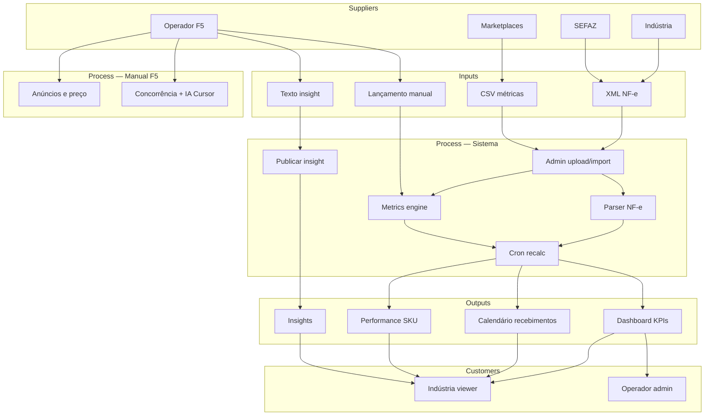

# F5 — Mapa SIPOC
## Suppliers · Inputs · Process · Outputs · Customers

**Versão**: 1.0  
**Data**: Junho 2026  
**Status**: Fonte de verdade do processo operacional + software

> **Complementa** `docs/OPERATING_MODEL.md` (negócio) · `docs/EXECUTION_PLAN.md` (implementação) · `docs/PREMISES_BACKLOG.md` (gaps por premissa)  
> **Princípio**: F5 não é SaaS de marketplace — é **operação humana + software de controle**.

---

## Por que SIPOC no F5?

O SIPOC traduz a consultoria em **cadeia mensurável**:

| Letra | Pergunta F5 |
|-------|-------------|
| **S** — Suppliers | Quem fornece dados ou executa fora do sistema? |
| **I** — Inputs | O que entra na plataforma (arquivo, formulário, decisão)? |
| **P** — Process | O que o sistema faz vs o que o operador faz manualmente? |
| **O** — Outputs | O que a indústria e a F5 enxergam como resultado? |
| **C** — Customers | Quem consome cada output? |

Sem SIPOC formal, o produto vira “telas soltas”. Com SIPOC, cada feature do admin/portal tem **dono, SLA e métrica de processo**.

---

## SIPOC macro — valor F5 (consultoria digital)

```
┌─────────────────────────────────────────────────────────────────────────────┐
│ S — SUPPLIERS                                                                │
│   Indústria (fabricante) │ Marketplaces (ML, Amazon, Shopee) │ SEFAZ (NF-e) │
│   Operador F5 │ Gestor comercial │ IA (Cursor — ferramenta interna)          │
└─────────────────────────────────────────────────────────────────────────────┘
                                      │
                                      ▼
┌─────────────────────────────────────────────────────────────────────────────┐
│ I — INPUTS                                                                   │
│   XML NF-e │ CSV relatório marketplace │ Lançamento manual (KPIs)          │
│   Cadastro SKU │ Insight texto (operador) │ Decisão cenário (1–4)            │
└─────────────────────────────────────────────────────────────────────────────┘
                                      │
                                      ▼
┌─────────────────────────────────────────────────────────────────────────────┐
│ P — PROCESS                                                                  │
│   [Sistema] Upload → parse NF → idempotência → PaymentSchedule → dashboard  │
│   [Sistema] Import CSV / formulário → ProductMetrics → recalc agregados       │
│   [Sistema] Publicar insight visível ao cliente                               │
│   [Manual F5] Anúncio, preço, ads, concorrência, logística nos marketplaces │
│   [Manual F5] Revisão seg, insight sex, call comercial                      │
└─────────────────────────────────────────────────────────────────────────────┘
                                      │
                                      ▼
┌─────────────────────────────────────────────────────────────────────────────┐
│ O — OUTPUTS                                                                  │
│   Dashboard KPIs (vendas, variação, canais) │ Calendário D+15/D+60          │
│   Performance por SKU (receita, giro, conversão) │ Insights publicados       │
│   Readiness piloto │ Auditoria operador │ Relatório comercial (fora sistema) │
└─────────────────────────────────────────────────────────────────────────────┘
                                      │
                                      ▼
┌─────────────────────────────────────────────────────────────────────────────┐
│ C — CUSTOMERS                                                                │
│   Indústria (portal `/cliente`) │ Operador F5 (`/admin`) │ Fundadores (GMV)  │
└─────────────────────────────────────────────────────────────────────────────┘
```

---

## SIPOC semanal — fluxo operador (seg → sex)

Fonte: `docs/OPERATING_MODEL.md` · Card “Fluxo semanal” em `/admin`.

| Dia | S | I | P (sistema) | P (manual F5) | O | C | SLA |
|-----|---|---|-------------|---------------|---|---|-----|
| **Seg** | Marketplaces, NF acumulada | KPIs no admin | Central exibe giro baixo, lançamentos, insights pendentes | Revisar todos os clientes; priorizar SKUs em queda | Lista de ações da semana | Operador F5 | Até 12h seg |
| **Ter–Qua** | Concorrência, catálogo | Observações de busca/posição | — | Otimizar anúncios (preço, título, ads); IA no Cursor para rascunhos | Anúncios atualizados nos MPs | Indústria (indireto) | Contínuo |
| **Qui** | Relatório ML/Amazon, NF recebida | CSV + XML | Import CSV; upload NF-e; idempotência; recalc | Conferir parser; corrigir SKU órfão | Métricas + NF no sistema | Operador + sistema | Até 18h qui |
| **Sex** | Métricas consolidadas | Texto insight | Registrar insight `visibleToClient`; cron segunda recalcula | Redigir recomendação; call se piloto | Insight no portal; dashboard atualizado | Indústria viewer | Até 17h sex |
| **Seg+1** | Cron Vercel | DB tenant | `/api/cron/recalc-dashboard` | Validar números vs planilha | KPIs mês correntes | Indústria | 06:00 seg |

### Métricas de processo (SIPOC)

| Métrica | Fórmula | Meta piloto | Onde medir |
|---------|---------|-------------|------------|
| **Lead time NF → repasse** | `expectedDate - nfDate` | D+15 ML / D+60 Amazon | Portal financeiro |
| **% insights no prazo** | insights sex ÷ clientes ativos | 100% | Admin insights + auditoria |
| **Tempo revisão segunda** | min entre login e 1ª ação | < 30 min | Manual (futuro: in-app) |
| **Taxa NF duplicada** | rejeições idempotência ÷ uploads | < 5% | Gate 2 + audit log |
| **Conciliação admin ↔ portal** | divergência KPI | 0% | `gate3:validate` |
| **Giro baixo sem insight** | SKUs flag ÷ sem nota em 7d | 0 | Admin central (futuro) |

---

## SIPOC por entidade de dados

| Entidade | S | I | P | O | C | Tela / API |
|----------|---|---|---|---|---|------------|
| **Vendas** | SEFAZ, operador | XML NF-e | `lib/nf/parser` → `NotaFiscal` + `SalesItem` | Receita mês, por canal | Indústria | `/admin/nfe`, `/cliente` |
| **Recebimentos** | Regra negócio F5 | NF processada | `PaymentSchedule` D+15/D+60 | Calendário + total a receber | Indústria | `/cliente/financeiro` |
| **Performance SKU** | Marketplace | CSV ou form | `ProductMetrics` + recalc | Tabela produtos, giro, conversão | Indústria | `/admin/lancamentos`, `/cliente/produtos` |
| **Insights** | Operador F5 | Título + corpo + tenant | `InsightNote` + flag cliente | Feed insights | Indústria | `/admin/insights`, `/cliente/insights` |
| **Catálogo** | Indústria, operador | SKU manual / scrape pontual | `Product` por tenant | SKUs monitorados | Operador | `/admin/catalogo` |
| **Cliente (tenant)** | Comercial F5 | CNPJ, cenário, segmento | Onboarding + seed | Portal ativo | Indústria | `/admin/clientes`, `/cliente/perfil` |

---

## RACI por etapa crítica

| Etapa SIPOC | R (Responsible) | A (Accountable) | C (Consulted) | I (Informed) |
|-------------|-----------------|-----------------|---------------|--------------|
| Onboarding piloto | Operador F5 | Gestor comercial | Indústria | Fundadores |
| Upload NF-e | Operador F5 | Operador F5 | Indústria (se envia XML) | Cliente viewer |
| Lançamento métricas | Operador F5 | Operador F5 | — | Cliente viewer |
| Insight semanal | Operador F5 | Gestor conta | IA (rascunho P2) | Cliente viewer |
| Operação marketplace | Operador F5 | Operador F5 | Indústria (estoque/preço fábrica) | — |
| Validação gates | Agente / dev | Tech lead | Operador | Fundadores |
| Deploy produção | Dev / agente | Vinicius | — | Equipe |

---

## Controles de qualidade (gates ↔ SIPOC)

| Gate | Etapa SIPOC protegida | Comando |
|------|------------------------|---------|
| **Gate 0** | Fundação (docs + deploy) | Site no ar |
| **Gate 1** | Inputs admin (tenant, SKU, lançamento) | `pnpm gate1:validate` |
| **Gate 2** | Process NF + CSV (idempotência) | `pnpm gate2:validate` |
| **Gate 3** | Output cliente = mesmo tenant | `pnpm gate3:validate` |
| **Gate 4** | Output comercial (piloto pago) | `docs/GATE4_CHECKLIST.md` |
| **Health** | Process infra | `GET /api/health` |
| **Smoke prod** | Output público | `pnpm smoke:prod` |

---

## Mapeamento premissas ↔ SIPOC

| Premissa | Como o SIPOC reforça |
|----------|----------------------|
| **Escalável** | Cada input tem dono; filas (P2) desacoplam P de upload NF |
| **Guiado** | SLA por dia da semana; checklist in-app (P1) espelha esta tabela |
| **AI-first** | IA entra em **P manual** (Ter–Qua, Sex) — rascunho insight, concorrência |
| **Resiliente** | Idempotência NF; sistema não depende de API marketplace em **P** |
| **SIPOC** | Este documento — métricas de processo acima |

---

## Gaps SIPOC (produto ainda não reflete o mapa)

| # | Gap | Premissa | Prioridade |
|---|-----|----------|------------|
| 1 | Sem checklist in-app seg→sex com estado (feito/pendente) | Guiado | P1 |
| 2 | Giro baixo sem link SIPOC → insight | Guiado + SIPOC | P1 |
| 3 | Sem métrica “% insights no prazo” no admin | SIPOC | P1 |
| 4 | Cliente não confirma leitura do insight (feedback loop) | SIPOC | P2 |
| 5 | Preview NF/CSV antes de commit (controle qualidade input) | Resiliente + SIPOC | P1 |
| 6 | RLS DB — isolamento **C** por tenant | Resiliente | P0 |
| 7 | IA rascunho insight (human-in-the-loop) | AI-first | P2 |

→ Detalhamento e owners em **`docs/PREMISES_BACKLOG.md`**

---

## Diagrama — sistema dentro do SIPOC



---

## Referências

| Doc | Conteúdo |
|-----|----------|
| `docs/OPERATING_MODEL.md` | Divisão sistema vs operação manual |
| `docs/ARCHITECTURE_STRATEGY.md` | Entradas de dados, domínio, AI-first |
| `docs/EXECUTION_PLAN.md` | Fases e gates |
| `docs/PREMISES_BACKLOG.md` | Backlog P0–P2 por premissa |
| `docs/PILOT_RUNBOOK.md` | Execução Gate 2→4 |
| `docs/GATE4_CHECKLIST.md` | Checklist comercial semana 0/1 |

---

**Revisão**: atualizar este doc quando um novo **input** ou **output** entrar no produto (ex.: email insight, PDF mensal).
